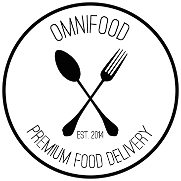

<!--
*** Thanks for checking out the Best-README-Template. If you have a suggestion
*** that would make this better, please fork the repo and create a pull request
*** or simply open an issue with the tag "enhancement".
*** Thanks again! Now go create something AMAZING! :D
***
***
***
*** To avoid retyping too much info. Do a search and replace for the following:
*** github_username, repo_name, twitter_handle, email, project_title, project_description
-->

<!-- PROJECT SHIELDS -->
<!--
*** I'm using markdown "reference style" links for readability.
*** Reference links are enclosed in brackets [ ] instead of parentheses ( ).
*** See the bottom of this document for the declaration of the reference variables
*** for contributors-url, forks-url, etc. This is an optional, concise syntax you may use.
*** https://www.markdownguide.org/basic-syntax/#reference-style-links
-->

[![LinkedIn][linkedin-shield]][linkedin-url]

<!-- PROJECT LOGO -->
<br />
<p align="center">
  <a href="https://github.com/rsous/Trillo">
    
  </a>

  <h3 align="center">Omnifood</h3>

  <p align="center">
    Project designed by Jonas Schmedtmann and built by myself.
    <br />
    <a href="https://github.com/rsous/omnifood"><strong>Explore the docs »</strong></a>
    <br />
    <br />
    <a href="https://rsous.github.io/omnifood/">View Demo</a>
    ·
    <a href="https://github.com/rsous/omnifood/issues">Report Bug</a>
    ·
    <a href="https://github.com/rsous/omnifood/issues">Request Feature</a>
  </p>
</p>

<!-- TABLE OF CONTENTS -->
<details open="open">
  <summary><h2 style="display: inline-block">Table of Contents</h2></summary>
  <ol>
    <li>
      <a href="#about-the-project">About The Project</a>
      <ul>
        <li><a href="#built-with">Built With</a></li>
      </ul>
    </li>
    <li>
      <a href="#getting-started">Getting Started</a>
      <ul>
        <li><a href="#installation">Installation</a></li>
      </ul>
    </li>
    <li><a href="#usage">Usage</a></li>
    <li><a href="#roadmap">Roadmap</a></li>
    <li><a href="#contact">Contact</a></li>
    <li><a href="#acknowledgements">Acknowledgements</a></li>
  </ol>
</details>

<!-- ABOUT THE PROJECT -->

## About The Project

Page designed by Jonas Schmedtmann for his online courses and built by myself while taking his Udemy course.

### Built With

- [CSS]()
- [Javascript]()

<!-- GETTING STARTED -->

## Getting Started

To get a local copy up and running follow these simple steps.

### Installation

1. Clone the repo
   ```sh
   git clone https://github.com/rsous/omnifood.git
   ```

<!-- USAGE EXAMPLES -->

## Usage

This project is just to showcase the results of my journey and small achievements in my front-end development learning process.

<!-- ROADMAP -->

## Roadmap

See the [open issues](https://github.com/rsous/omnifood/issues) for a list of proposed features (and known issues).

<!-- CONTACT -->

## Contact

Rodolfo - [@rsous3](https://twitter.com/rsous3) - rsous@pm.me

Project Link: [https://github.com/rsous/omnifood](https://github.com/rsous/omnifood)

<!-- ACKNOWLEDGEMENTS -->

## Acknowledgements

- [Jonas Schmedtmann](https://codingheroes.io)

<!-- MARKDOWN LINKS & IMAGES -->
<!-- https://www.markdownguide.org/basic-syntax/#reference-style-links -->

[contributors-shield]: https://img.shields.io/github/contributors/rsous/repo.svg?style=for-the-badge
[contributors-url]: https://github.com/rsous/repo/graphs/contributors
[forks-shield]: https://img.shields.io/github/forks/rsous/repo.svg?style=for-the-badge
[forks-url]: https://github.com/rsous/repo/network/members
[stars-shield]: https://img.shields.io/github/stars/rsous/repo.svg?style=for-the-badge
[stars-url]: https://github.com/rsous/repo/stargazers
[issues-shield]: https://img.shields.io/github/issues/rsous/repo.svg?style=for-the-badge
[issues-url]: https://github.com/rsous/repo/issues
[license-shield]: https://img.shields.io/github/license/rsous/repo.svg?style=for-the-badge
[license-url]: https://github.com/rsous/repo/blob/master/LICENSE.txt
[linkedin-shield]: https://img.shields.io/badge/-LinkedIn-black.svg?style=for-the-badge&logo=linkedin&colorB=555
[linkedin-url]: https://linkedin.com/in/rsous
